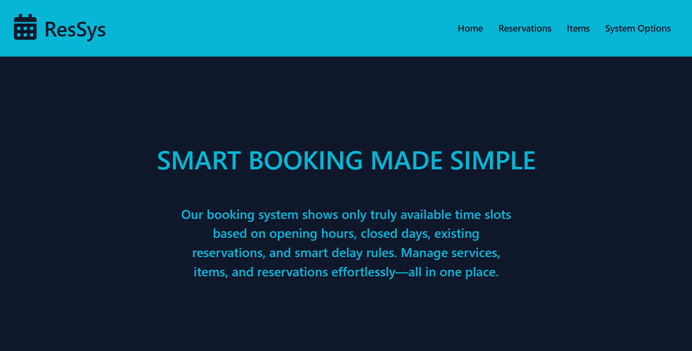

# Reservation System (ASP.NET Core Web App(Model-View-Controller))

This project is an ASP.NET Core MVC application for managing a reservation system.
It allows managing services, items, and reservations, with core features for booking and scheduling appointments.
---
### Users can:
  1. View a list of available reservations and items
  2. Make reservations for selected services
  3. Select available time slots based on service duration and system settings

## 🖥️ Preview



## 🚀 How to Run the Project

### 1. Clone the Repository
```bash
git clone https://github.com/Ados-developer/ReservationSystem.git
cd ReservationSystem
```
### 2. Database
  1. In SQL Server Management Studio 20, create a new database.
  2. Run the SQL script repositories/sql/db.sql to populate the database with the sample data.
  3. Update the connection string in appsettings.json to match your SQL Server setup.

### 3. Run the app
```bash
dotnet run
```

## Requirements
1. [.NET 8 SDK](https://dotnet.microsoft.com/download/dotnet/8.0)  
2. [SQL Server](https://learn.microsoft.com/en-us/sql/ssms/download-sql-server-management-studio-ssms)
